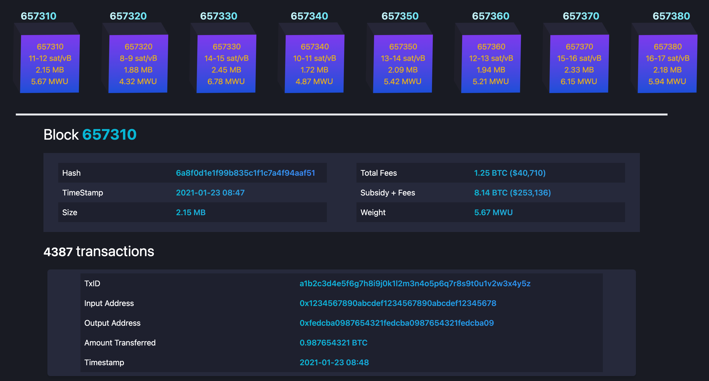
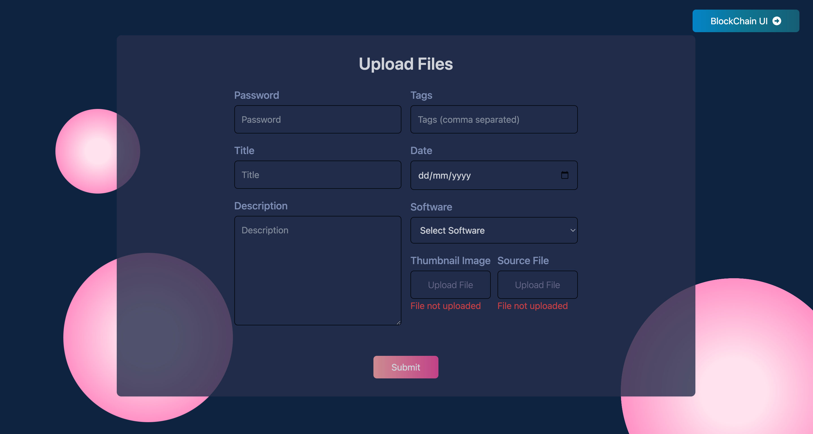

# Project Title

Welcome! This project is a comprehensive application that seamlessly integrates
form submission with database updates and provides an interactive interface for
a blockchain-based cryptocurrency system. Users can easily upload images and files,
fill out essential details.

## Screenshots




## Features

- **Secure Form Submission:** The application enforces strong password requirements and provides detailed form validation to ensure data accuracy.
- **File Uploads:** Users can upload thumbnail images and source files with real-time feedback on file selection status.
- **Responsive Design:** The user interface is designed to be responsive, offering a consistent experience across various devices.

## Getting Started

To explore and use the project, follow the steps outlined below.

### Prerequisites

Make sure you have the following installed:

- [Node.js](https://nodejs.org/)
- [npm](https://www.npmjs.com/)

### Installation

1. Clone the repository:

   ```bash
   git clone https://github.com/your-username/your-repo.git
   cd your-repo
   ```

2. Install Dependencies:

   ```bash
   npm install
   npm start
   ```
